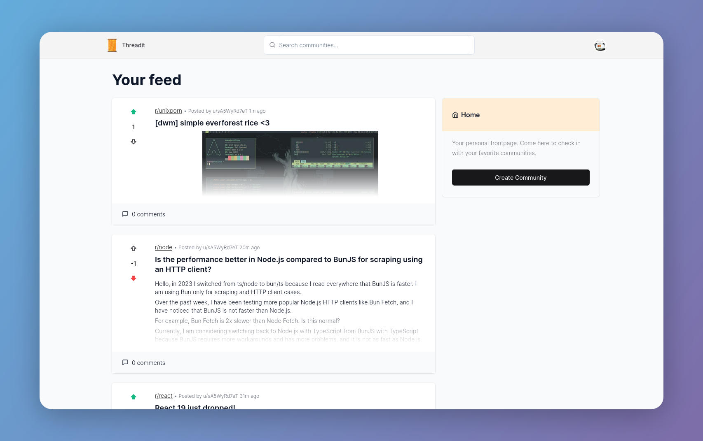

<h1 align="center">Threadit</h1>
<h3 align="center">A minimal Reddit clone built with Next.js</span>

<p align="center">
    
</p>

## Features 📝

- ⚡ [Next.js](https://nextjs.org) with App Router support
- 🔥 Type checking [TypeScript](https://www.typescriptlang.org)
- 💎 Integrate with [Tailwind CSS](https://tailwindcss.com) and Shadcn UI
- 🔒 Authentication with [NextAuth](https://next-auth.js.org): Sign up, Sign in, Sign out, Forgot password, Reset password, and more.
- 👤 Social Auth (Google)
- 📦 Type-safe ORM with Prisma, compatible with PostgreSQL and MySQL
- ♻️  Type-safe environment variables with T3 Env
- ⌨️  Form with React Hook From
- 🔴 Validation library with Zod
- 📏 Linter with [ESLint](https://eslint.org) (default NextJS, NextJS Core Web Vitals, Tailwind CSS and Airbnb configuration)
- 💖 Code Formatter with [Prettier](https://prettier.io)
- 👷 Run deployment on pull request with GitHub Actions
- 💡 Absolute Imports using `@` prefix

## Live Demo 🔴

<p>You can view a live demo by clicking <a href="https://reddit-clone-zeta-woad.vercel.app/">HERE</a></p>

## Installation

To run the application on your local machine, follow these steps.

1. Clone the repository to your local machine.

```sh
git clone https://github.com/Armadillidiid/reddit-clone.git
```

2. Go to folder, and copy `env-local-dev` as `.env.local`

```
cd reddit-clone/
cp env-local-dev .env.local
```

3. Setup authentication

Create a new OAuth 2.0 client ID in the Google Cloud Console. Add the client ID and client secret to the `.env.local` file.

```
NEXTAUTH_URL=http://localhost:3000
GOOGLE_ID=YOUR_GOOGLE_ID
GOOGLE_SECRET=YOUR_GOOGLE_SECRET
```

4. Setup image upload

Create a new bucket in AWS S3. Add the bucket name, access key, and secret key to the `.env.local` file.

```
AWS_REGION=YOUR_AWS_REGION
AWS_BUCKET_NAME=YOUR_AWS_BUCKET_NAME
AWS_ACCESS_KEY_ID=YOUR_AWS_ACCESS_KEY_ID
AWS_SECRET_ACCESS_KEY=YOUR_AWS_SECRET_ACCESS_KEY
```

5. Run the project.

```sh
docker compose up
```

6. Open your browser and go to `http://localhost:3000`
